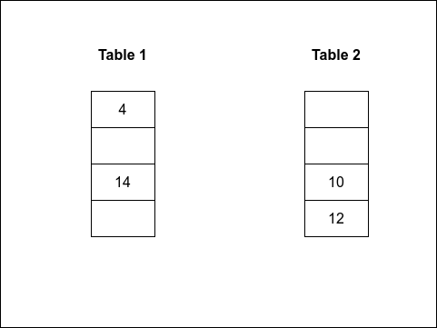
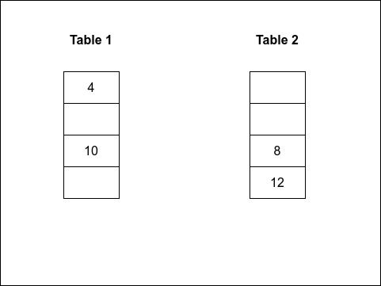
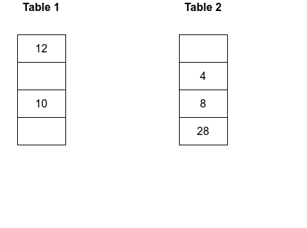
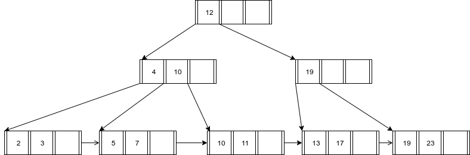
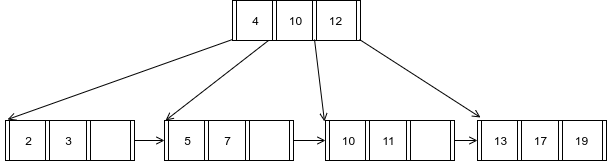
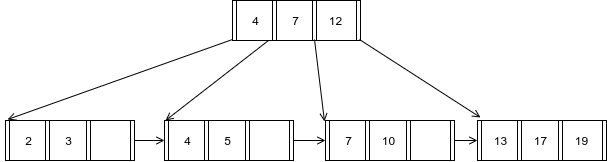
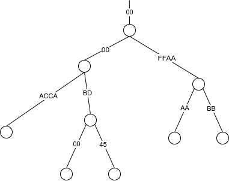

## Question 1

### a

## b

### c

### D - 6

## Question 2

### A

### B - 4

### C

### D

## Question 3

### A

1. 3

2. 1

3. 3

### B

1. 17

2. 23

### C

1. 13

2. 13

## Question 4

### A - None of the above

### B

